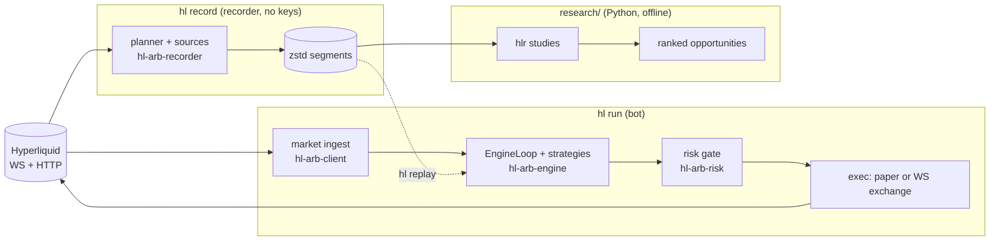

# hl-arb-bot

A **low-latency arbitrage / MEV-style trading system for
[Hyperliquid](https://hyperliquid.xyz)**, written in Rust (HyperCore first,
HyperEVM later).

- **Evidence before strategy.** A keyless recorder stores raw market data and an
  offline Python toolkit measures edge net of costs. Only strategies with a
  passing study get built.
- **Latency first.** One single-threaded, event-driven engine serves `observe`,
  `simulate`, `live`, and deterministic `replay`; only the I/O edges differ.
- **Safety first.** The default mode never trades. `live` is gated and uses an
  agent wallet that cannot withdraw.

The original Ethereum Uniswap V2 bot is retired under [`legacy/`](legacy/)
(reference only, never built).

> **Status:** M0-M2.5 done (platform, market data, signing/execution,
> hardening; only the H-10 testnet round-trip is open) and the T0 fix-first
> list is complete. The recorder has run since 2026-09-29; the research toolkit
> (SPEC-0008 P-2…P-5, B-1…B-3, B-9) is built and the first preliminary studies
> are in: **no strategy passes at base fees**
> ([`research/reports/prelim-2026-10-03/`](research/reports/prelim-2026-10-03/)).
> The authoritative roadmap and success metrics are in
> [`docs/GOAL.md`](docs/GOAL.md); status is derived from the spec tables.

## Architecture

Three processes that never share a hot path:



Details: [`docs/ARCHITECTURE.md`](docs/ARCHITECTURE.md).

## Quick start

Requires Rust 1.90+. The offline research toolkit additionally needs Python
3.12 and [`uv`](https://docs.astral.sh/uv/) (see
[`research/README.md`](research/README.md)). None of the commands below need
keys; the network ones only read public market data.

```sh
cargo build --workspace
cargo test --workspace

cargo run -p hl-arb-bot -- --help                  # the `hl` CLI
cargo run -p hl-arb-bot -- config show             # resolved config, secrets redacted
cargo run -p hl-arb-bot -- record plan             # recorder plan; fetches public metadata
cargo run -p hl-arb-bot -- run --mode observe      # connect, build state, never trade
cargo run -p hl-arb-bot -- run --mode simulate     # run strategies against paper fills
cargo run -p hl-arb-bot -- replay --from 2026-09-30 --to 2026-09-30 --rec-dir data/rec
                                                # replay recorder segments (needs data/rec)
```

While `hl run` is up: `curl localhost:9090/healthz`, `/readyz`, `/metrics`.

Config layers, lowest to highest: built-in defaults, `config/default.toml`,
`config/{HL_ENV}.toml`, `HL_*` env vars, CLI flags. `.env.example` lists the
variables. Recorder profiles live in `config/record.toml`.

## Safety model

| Mode | Behavior | Keys needed |
|---|---|---|
| `observe` (default) | connect and build state; never places orders | none |
| `simulate` | run strategies, simulate fills; never submits | none |
| `live` | submit orders through the risk gate | agent key + `HL_LIVE_CONFIRM=YES` |

- Only an **agent wallet** (cannot withdraw) is ever on the host.
- Every order passes the risk engine; `live` also arms a dead-man's switch.
- The recorder and research code never load keys.

Operations: [`RUNBOOK.md`](RUNBOOK.md).

## Repository layout

Formerly `mev-bot` (crates `mev-*`); the binary is `hl`.

| Path | What |
|---|---|
| [`crates/hl-arb-core`](crates/hl-arb-core) | common: config, clock, errors, SQLite store, watchlist |
| [`crates/hl-arb-metrics`](crates/hl-arb-metrics) | common: tracing, Prometheus metric names, health |
| [`crates/hl-arb-client`](crates/hl-arb-client) | client: Hyperliquid REST/WS, signing, nonces, orders |
| [`crates/hl-arb-hyperevm`](crates/hl-arb-hyperevm) | client: HyperEVM (deferred) |
| [`crates/hl-arb-recorder`](crates/hl-arb-recorder) | client/tooling: market-data recorder (segments, planner, reader) |
| [`crates/hl-arb-strategy`](crates/hl-arb-strategy) | domain: cost model, views, intents, sizing, paper executor |
| [`crates/hl-arb-risk`](crates/hl-arb-risk) | domain: limit gate, kill switch, halt |
| [`crates/hl-arb-engine`](crates/hl-arb-engine) | domain: event-driven engine, order manager, v2 strategies |
| [`crates/hl-arb-bot`](crates/hl-arb-bot) | app: the `hl` binary (CLI and orchestration) |
| [`research/`](research) | offline Python research toolkit |
| [`config/`](config) | default and recorder configs |
| [`deploy/`](deploy) | recorder run scripts and deployment notes |
| [`scripts/`](scripts) | CI helpers (benchmark regression check) |
| [`docs/`](docs) | goal, architecture, references ([index](docs/README.md)) |
| [`specs/`](specs) | specifications and ADRs |
| [`legacy/`](legacy) | retired Ethereum bot, reference only |

## Development

```sh
cargo fmt --all
cargo clippy --workspace --all-targets -- -D warnings
cargo test --workspace
# research/ changes:
cd research && uv run ruff check && uv run pytest
```

Contributor and agent rules: [`AGENTS.md`](AGENTS.md). Specs are the source of
truth; the index is in [`docs/README.md`](docs/README.md).

## License

MIT, see [LICENSE](LICENSE).
