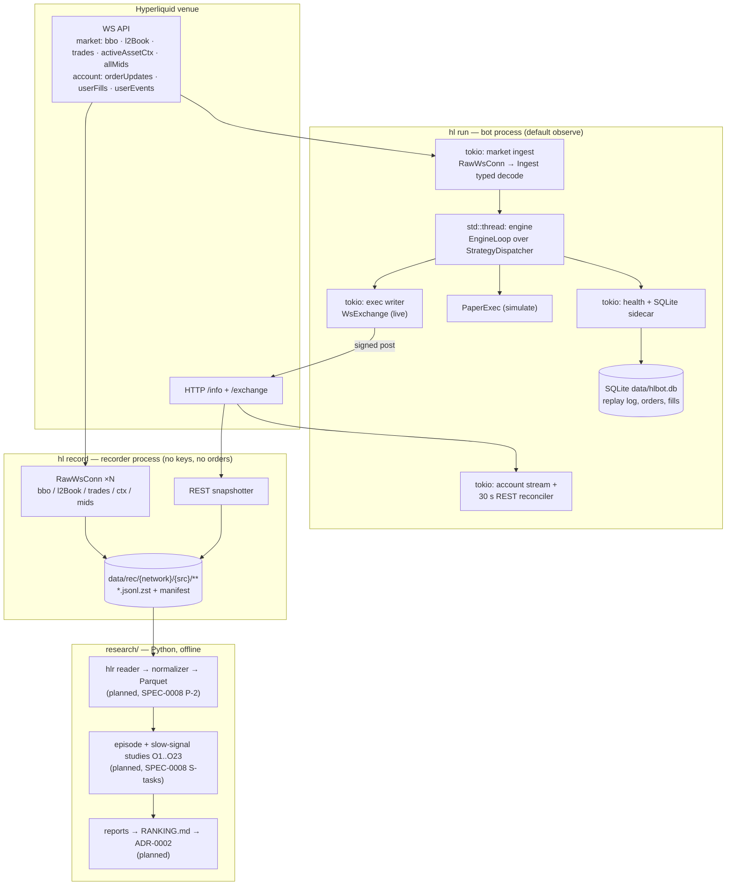
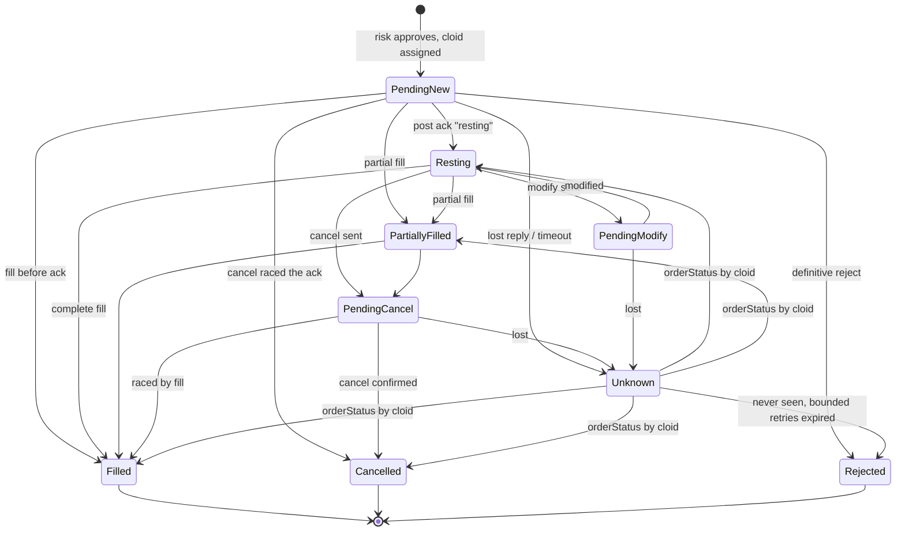
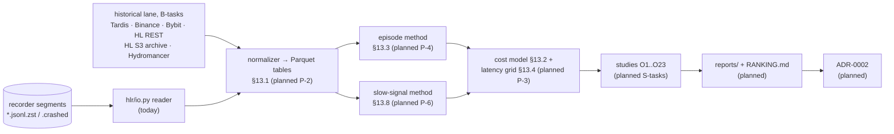

# Architecture

> How the system is put together, and why. This describes **the code as it is
> today**; anything not yet built is marked *(planned, SPEC-…)*. Read
> [`GOAL.md`](GOAL.md) first for the goal and the latency-first rules, then the
> owning spec for any component.

## 1. Overview

The project is a Rust workspace that trades Hyperliquid (HyperCore first,
HyperEVM later). Three processes are involved, and they never share a hot path:
the **`hl` bot** (connect, decide, and — only in `live` — submit), the
**`hl record` recorder** (a separate, keyless process that stores raw market
data), and the **offline Python research toolkit** that turns those recordings
into evidence for what to trade. The bot runs the same single-threaded,
event-driven engine in `observe`, `simulate`, `live`, and deterministic
`replay`; only the I/O edges differ.



## 2. Crate map

Dependency direction is strictly downward: `hl-arb-core` depends on nothing
internal; `hl-arb-bot` wires everything. The engine loop and the v2 `Strategy`
trait live in **`hl-arb-engine`**, not `hl-arb-strategy`, because the trait's `Ctx`
names engine types (SPEC-0010 §23 Q-Layering).

| Crate | Responsibility | Key types | Spec |
|---|---|---|---|
| `hl-arb-core` | config, clock, errors, watchlist, SQLite store + single writer | `Config`, `Clock`/`SystemClock`, `Db`/`DbWriter`, `watchlist::load`/`save` | 0000, 0004 |
| `hl-arb-client` | HyperCore REST/WS client, wire types, market state, order builder, nonce, EIP-712 signing, transports, dead-man switch | `InfoApi`/`HttpInfo`, `MarketStream`/`WsMarketStream`, `ExchangeApi`/`WsExchange`/`HttpExchange`, `RawWsConn`, `MarketSelector`, `MarketState`, `AgentSigner`, `NonceManager`, `DeadMansSwitch`, `CloidFactory`, `HlProtocol` | 0001, 0002 |
| `hl-arb-engine` | event-driven core: interned ids, typed ingest, engine loop, order manager, risk gate integration, order builder, paper exec, reconcile, latency instrumentation, action journal, the v2 strategies | `EngineLoop`, `StrategyDispatcher`, `CoinId`/`CoinRegistry`, `MarketUpdate`/`AccountUpdate`, `OrderManager`, `RiskGate`, `AssetTable`, `PaperExec`, `Reconciler`, `FundingBasis`, `MarketMaker`, `Strategy` | 0010 |
| `hl-arb-strategy` | venue-agnostic building blocks: cost/edge model, views, intents, sizing, paper executor, deterministic RNG | `CostModel`/`FeeRates`, `MarketView`/`AccountView`/`BookView`, `OrderIntent`, `Sizer`, `PaperExecutor`, `DeterministicRng` | 0003, 0011 |
| `hl-arb-risk` | fail-closed per-order limit gate, kill switch, trading halt | `LimitRisk`, `Limits`, `KillSwitch`, `TradingHalt`, `cancel_all_cloids` | 0004 |
| `hl-arb-recorder` | envelope format, per-connection segment writer/reader, subscription planner, HL REST snapshotter | `Envelope`/`Kind`, `SegmentWriter`/`SegmentReader`, `Plan`/`HlProfile`, `RestSnapshotter` | 0008 |
| `hl-arb-metrics` | `tracing` init, metric names, health, Prometheus recorder | `names`, `Health`, `install_recorder()` | 0000, 0006 |
| `hl-arb-bot` | the `hl` binary: CLI, orchestration, live I/O tasks, recorder CLI, replay driver | `Command`, `run()`, `live::*`, `record::*`, `replay::*`, `engine::build` | all |
| `hl-arb-hyperevm` | HyperEVM chain ids only — **deferred** | `chain::{MAINNET, TESTNET}` | 0005 |

## 3. The hot path

The hot path is socket read → order bytes on the socket (GOAL §5.1). The
decision path crosses exactly one thread boundary by design: the async ingest
tasks decode and hand off over a bounded channel; one `std::thread` owns all
trading state and never awaits, locks long, or does I/O.

```mermaid
sequenceDiagram
  participant Sock as market WS socket
  participant Ingest as ingest task (tokio)
  participant Mkt as market channel (65 536, lossy)
  participant Eng as engine thread (std::thread)
  participant Strat as Strategy (sync)
  participant Risk as RiskGate
  participant Build as builder::plan_iteration
  participant XCh as exec channel + bridge
  participant W as exec writer (tokio)
  participant Ex as WsExchange / socket

  Sock->>Ingest: frame read (t_recv)
  Ingest->>Ingest: typed decode — hl_decode_seconds
  Ingest->>Mkt: send_market (drops new when full)
  Mkt->>Eng: drain all, apply to MarketSlot, mark dirty coins
  Eng->>Strat: on_market(coin, Ctx) → Actions
  Strat-->>Eng: Place / Cancel / Modify
  Eng->>Risk: check(action) — fail closed
  Risk-->>Eng: Approve / Resize / Reject
  Eng->>Build: cancels → cancelByCloid, places → one bulk order
  Build->>XCh: UnsignedPost (try_send; full ⇒ halt)
  XCh->>W: crossbeam → tokio mpsc bridge
  W->>Ex: enqueue: sign (hl_sign_seconds) + write frame
  Ex-->>W: reply by req_id (hl_submit_ack_seconds)
  W->>Eng: PostAck on the account channel
  Note over Eng,Ex: hl_tick_to_order_seconds = t_written − t_recv
```

Hops and their queues (`crates/hl-arb-bot/src/main.rs`, `crates/hl-arb-engine/src/`):

| Hop | Runs on | Channel | Full ⇒ |
|---|---|---|---|
| Market ingest → engine | tokio task → engine thread | `crossbeam_channel`, cap 65 536 | **drop the new message**; count `hl_engine_market_drops_total`; the next full snapshot repairs state |
| Account/control/exec replies → engine | tokio task → engine thread | `crossbeam_channel`, cap 16 384 | the sender **blocks** (lossless by contract) |
| Engine → exec writer | engine thread → bridge thread → tokio task | `Outbound<UnsignedPost>`, cap 16 384 | **fail closed**: reject the batch, trip the `exec_backpressure` breaker |
| Engine → persistence/metrics | engine thread → `DbWriter` thread | bounded `sync_channel` | drop the write and warn (never back-pressure trading) |

Conflation: `bbo`/`l2Book` frames are full snapshots, so the engine drains
**all** pending market updates, applies each cheaply, and then dispatches a
dirty coin **once** on its latest state (`crates/hl-arb-engine/src/run.rs`).

Latency stamps and metric names (`crates/hl-arb-engine/src/instrument.rs`,
`crates/hl-arb-metrics/src/lib.rs`). The engine-side `hl_engine_*` recorder exists
in the loop but the `hl` binary does **not** export it yet *(planned)*; the
`hl_*` names below are recorded on the live path today.

| GOAL §5.2 stage | Code location | Metric | Budget (p50 / p99) |
|---|---|---|---|
| WS frame → decoded event | `Ingest::decode`, `ingest.rs:520` | `hl_decode_seconds` | ≤ 20 µs / 100 µs |
| State update + strategy decision | `run.rs` iterate + `StrategyDispatcher::dispatch_coin` | `hl_engine_decide_seconds` (engine-side) | ≤ 30 µs / 200 µs |
| Risk check | `RiskGate::check`, `risk.rs:520` | `hl_engine_risk_seconds` (engine-side) | ≤ 10 µs / 50 µs |
| Order build + msgpack + EIP-712 sign | `WriteCore::prepare`, `exchange.rs:468` | `hl_sign_seconds` | ≤ 150 µs / 500 µs |
| Write to socket | exec writer, `live.rs:68` | `hl_exec_queue_seconds` | ≤ 20 µs / 100 µs |
| **Total internal tick-to-order** | socket read → frame written to socket | **`hl_tick_to_order_seconds`** | **≤ 100–250 µs / 1 ms** |
| Network RTT (send → venue ack) | `WsExchange::enqueue_split`, `ws_exchange.rs` | `hl_submit_ack_seconds` | minimize |

Socket rules: `TCP_NODELAY` is set on both the market and exec sockets. The
market connection is dialed once at startup and reopened with backoff; the exec
`WsExchange` connects lazily on its first post (a pre-warm hook, `warm()`,
exists but `hl` does not call it yet) (SPEC-0010 §12/§18).

## 4. Modes and I/O backends

One engine serves every mode (SPEC-0010 G-5/G-6). Strategies are pure and
synchronous; they read time only from `Ctx::now`, so the same code is
deterministic under replay (`crates/hl-arb-engine/src/dispatch.rs`).

| Mode | Market input | Strategies | Exec backend | Clock | Notes |
|---|---|---|---|---|---|
| `observe` (default) | live WS | **none** (empty plan) | none | `LiveClock` | connect + build state; zero `/exchange` calls; no keys |
| `simulate` | live WS | yes | `PaperExec` fills in-process against the book after `latency_ms` | `LiveClock` | never submits; no keys required |
| `live` | live WS | yes | `Outbound<UnsignedPost>` → `WsExchange` writer | `LiveClock` | agent key + `HL_LIVE_CONFIRM=YES`; fail-closed finite limits required |
| `replay` | recorder segments, decoded by the same ingest decoders | yes | `PaperExec` with the same latency model | `ReplayClock` | deterministic: pinned cloid prefix + action journal; opens no sockets, loads no keys |

`hl replay` runs the *real* engine over recorded data
(`crates/hl-arb-bot/src/replay.rs`): the same input must produce a byte-identical
action journal (FNV-1a fingerprint). There is also a legacy SQLite-session
replay path when `--from` is absent.

## 5. Order lifecycle & safety

Every order the engine sends is tracked by its 16-byte `cloid`
(`[u8; 16]`), assigned by the engine if the strategy did not supply one
(per-process random prefix + counter; `hl replay` pins the prefix for
determinism). `OrderManager` keeps an incremental worst-case in-flight notional
per coin, so risk counts orders that have not yet been confirmed.



- **Unknown outcomes are reconciled by `cloid`**, never by resending. A lost
  reply marks the orders `Unknown`; a spawned task queries `orderStatus` by
  `cloid` with capped backoff, and a never-seen order resolves `Rejected` after
  the bound (`crates/hl-arb-bot/src/live.rs`).
- **Account stream is the source of truth** for own orders and fills:
  `orderUpdates`, `userFills`, and `userEvents` run on their own lossless
  connection (`crates/hl-arb-bot/src/live.rs`). Fills come from `userFills` only,
  are de-duplicated by venue `tid`, and map to orders via an `oid → cloid`
  index; the REST reconciler is a 30 s backstop.
- **Dead-man switch** (`scheduleCancel`): armed only while an order rests,
  refreshed at half the TTL (default 120 s), disarmed on graceful shutdown. An
  arm/refresh failure while orders rest fails closed by sending
  `Control::KillSwitch` (`crates/hl-arb-bot/src/main.rs` `deadman`).
- **Kill switch** (SPEC-0004 K-3): `SIGUSR1`, the flag file `data/KILL`
  (`HL_KILL_FILE`, polled every 250 ms), or `hl panic`; it cancels every working
  order and halts new places. Clearing is two-key: `hl resume` **and**
  `SIGUSR2`, and `SIGUSR2` is ignored while the flag file exists.
- **Risk is fail-closed**: `live` refuses to start unless
  `max_order_notional_usd`, `max_position_notional_usd`, `max_open_orders`,
  `max_margin_utilization_bps`, `max_daily_loss_usd`, and `max_unhedged_usd`
  are all explicitly finite (`crates/hl-arb-core/src/config.rs` `validate`). The
  check order is kill → breaker → stale coin → unknown-on-coin → rate budget →
  notional → projected exposure → margin → tick/min-notional
  (`crates/hl-arb-engine/src/risk.rs`).

## 6. Persistence

- **SQLite** (`rusqlite`, WAL) is the bot's store, written only by a single
  `DbWriter` thread fed over a bounded channel — never from the hot path
  (SPEC-0004 §9). Tables (`crates/hl-arb-core/src/db.rs`): `meta`, `sessions`,
  `events` (the replay log, with writer-assigned monotonic `seq`), `orders`,
  `fills`, `funding`, `positions_snapshot`, `open_orders_snapshot`.
- **Nonce high-water mark** lives in `meta` under `nonce.last` and is persisted
  before a live send, so a restart cannot reuse a nonce
  (`crates/hl-arb-client/src/nonce.rs`, `exchange.rs`).
- **Recorder segments** (`crates/hl-arb-recorder/`): one JSON-lines **envelope**
  per line (`v`, `src`, `conn`, `seq`, `t_ns`, `mono_ns`, `kind`, `raw`/`meta`),
  zstd-compressed, rotated at the top of each UTC hour or 1 GiB uncompressed.
  A segment in progress is `*.jsonl.zst.partial`; on a clean finalize it gains a
  `segment_close` and is renamed final with a `manifest.jsonl` line. On startup
  any leftover `.partial` becomes `*.jsonl.zst.crashed` (readable up to its last
  complete line). A dropped envelope is a `gap_start`; `hl record inspect`/`verify`
  report gaps, `seq` holes, and coverage.

## 7. Research pipeline

Research is where the decision "what do we trade" is made; it never runs in the
bot. Today the toolkit has the segment **reader** (`research/hlr/io.py`), the
Tardis **backfill downloader** (`research/hlr/backfill/tardis.py`, task B-1),
and the shared §13.1 **table schemas** (`research/hlr/tables.py`). The
normalizers that populate those tables and the studies are in progress/planned
(SPEC-0008 Part B, P-2…P-6, S-tasks).



Historical data (Tardis free days, HL `/info`, requester-pays S3 archives) can
**prioritize** studies and kill bad ideas early, but only forward recording can
PASS one (SPEC-0008 §13.11).

## 8. Key design decisions

- **Single-threaded, lock-free engine.** One `std::thread` owns all trading
  state; no `Arc<RwLock<...>>`, no `.await`, no blocking I/O on it (SPEC-0010
  §4/§5). Async I/O tasks are edges that feed it over bounded channels.
- **Exact money math.** `rust_decimal` in every production money path; never
  `f64` (GOAL §4.5, SPEC-0000 §4).
- **WebSocket `post` is the default transport.** Concurrent in-flight posts on
  one socket with reply routing by `req_id`; REST `/exchange` is the fallback
  (SPEC-0002 §8/§16, ADR-0001).
- **Evidence before strategy.** The recorder + research pipeline gates what
  goes live; a study report is required before any strategy trades real money
  (GOAL §4.1, SPEC-0008).
- **Agent wallet only.** The key on the host is an agent/API wallet that cannot
  withdraw; the master key is never present (GOAL §4.2, SPEC-0002 §4.3).
- **Fail closed.** Unknown order outcomes reconcile by `cloid`; a full exec
  channel halts rather than queues; `live` requires explicit finite limits
  (SPEC-0010 §11/§16, SPEC-0004).
- **One engine, three I/O edges.** `live`, `simulate`, and `replay` share the
  decision code and differ only at the edges, which is what makes replay a
  trustworthy backtest (SPEC-0010 §14, G-5/G-6).
- **Reuse the raw WS connection.** The recorder and the bot share
  `RawWsConn` (watchdog, jittered reconnect, gap events) so there is one shared
  socket implementation (SPEC-0008 R-3).

## 9. Where to start reading the code

1. `crates/hl-arb-bot/src/main.rs` — CLI, orchestration, ingest, health, shutdown.
2. `crates/hl-arb-bot/src/live.rs` — exec writer, account stream, kill-switch control.
3. `crates/hl-arb-engine/src/run.rs` — the per-iteration engine loop.
4. `crates/hl-arb-engine/src/dispatch.rs` — strategy dispatch, risk gating, batch/send.
5. `crates/hl-arb-engine/src/orders.rs` — order state machine and in-flight exposure.
6. `crates/hl-arb-engine/src/risk.rs` — the fail-closed risk gate.
7. `crates/hl-arb-engine/src/builder.rs` — cloid assignment, rounding, aggressive pricing.
8. `crates/hl-arb-client/src/exchange.rs` / `ws_exchange.rs` — signing and WS `post`.
9. `crates/hl-arb-bot/src/record.rs` + `crates/hl-arb-recorder/src/` — the recorder.
10. `crates/hl-arb-bot/src/replay.rs` — deterministic replay over segments.
